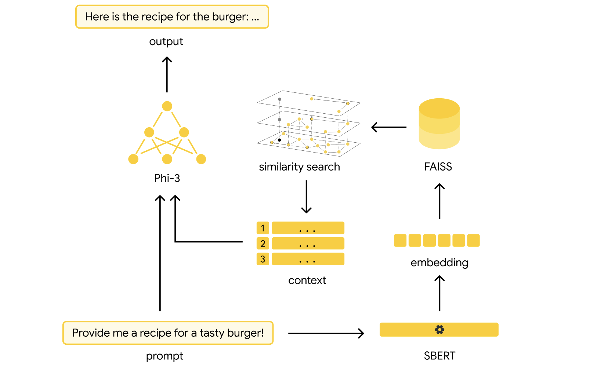

# 🥑 RecipeCraft - Recipe Retrieval with RAG, FAISS & Ollama

**RecipeCraft** is an AI-powered recipe retrieval system that combines modern vector search with large language models (LLMs). Built with FAISS indexing, Sentence Transformers, and the Ollama framework, it enables semantic recipe search using natural language prompts.

---

## 📁 Project Structure

```
recipe-craft/
├── config/
│   ├── config_model_client.yaml   # Configuration for the LLM model client
│   └── config_rag.yaml            # Main configuration for embedding, index, and paths
├── data/                          # Initial recipe dataset in JSON format
├── src/
│   ├── llm/
│   │   └── model_client.py        # Logic for interacting with the Ollama-hosted LLM
│   ├── rag/
│   │   └── retriever.py           # RecipeRetriever class: embedding, indexing, and retrieval
│   └── utils/
│       └── utils_file.py          # File loading/saving utilities (JSON, YAML)
├── app.py                         # FastAPI application entrypoint
├── docker-compose.yml             # Docker Compose configuration
├── Dockerfile                     # Docker image definition
├── requirements.txt               # Python dependencies
└── README.md                      # This file
```

## 🔄 Workflow diagram



---

## 🚀 How to Launch

### 1. Clone the repository
```bash
git clone https://github.com/slavastar/recipe-craft.git
cd recipe-craft
```

### 2. Download the dataset
Download the recipe textual dataset using this [link](https://eightportions.com/datasets/Recipes/#fn:1).

Place the dataset inside the `data` folder of the project, so the structure looks like this:

```
recipe-craft/
├── data/                          # Initial recipe dataset in JSON format
├───── *.json                      # JSON files containing recipes
```    

### 3. Launch the project using Docker
```bash
docker compose up --build
```

- This will build the image and start the application.
- **Note:** Image construction and container initialization may take several minutes.
- Once running, access the application at: [http://localhost:8000/docs](http://localhost:8000/docs)

### 4. Interact with the API
- Visit the `/ask` endpoint in Swagger UI
- Enter a natural language query (e.g. "Show me a vegan pasta recipe with spinach")
- The system may take several dozen seconds to respond depending on model initialization

---

## ⬇️ Response example


## 🧠 Technologies Used

| Component        | Description                                    |
|------------------|------------------------------------------------|
| **Embedding Model** | `all-MiniLM-L6-v2` via Sentence Transformers |
| **LLM**          | `phi3` hosted using [Ollama](https://ollama.com) |
| **Vector Storage** | FAISS index of type `IVFPQ`                   |
| **Containerization** | Docker + Docker Compose                     |
| **API**          | FastAPI + Swagger for interactive exploration  |

---

## 📚 Resources

- 📖 Original recipe dataset: [EightPortions Recipe Dataset](https://eightportions.com/datasets/Recipes/)
- 🔗 Ollama LLM runner: [https://ollama.com](https://ollama.com)
- 📦 FAISS documentation: [https://faiss.ai](https://faiss.ai)
- 🤗 SentenceTransformers: [https://www.sbert.net](https://www.sbert.net)

---

## 🛠️ Notes

- The first-time image build will download models and tools which may take a few minutes.
- Model initialization during the first prompt may also delay response.
- FAISS `IVFPQ` index requires training and may not respond until trained.

---
